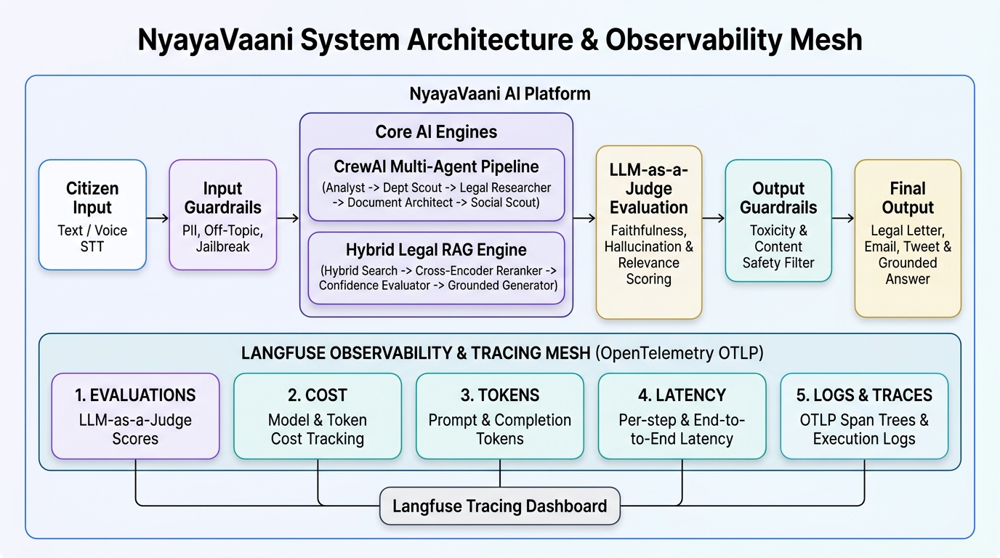

<div align="center">

# ⚖️ NyayaVaani: Agentic AI Civic Assistant & Legal RAG Platform

[](https://www.python.org/)
[](https://fastapi.tiangolo.com/)
[](https://www.crewai.com/)
[](https://deepmind.google/technologies/gemini/)
[](https://openai.com/research/whisper)
[](https://langfuse.com/)
[](https://opensource.org/licenses/MIT)

**NyayaVaani** (Voice of Justice) is an enterprise-grade, multimodal AI platform designed to empower Indian citizens in civic grievance redressal and legal awareness. It integrates a **5-Agent Autonomous CrewAI Workflow**, a **Hybrid Legal RAG Pipeline (Dense + Sparse + Reranker)**, **NeMo-inspired Security Guardrails**, and **OpenTelemetry/Langfuse Observability**.

[Explore Architecture](#-system-architecture--observability-mesh) • [Tech Stack](#-technology-stack--model-topology) • [Security & Metrics](#-security-guardrails--observability-metrics) • [Quickstart](#-installation--setup)

</div>

---

## 🌟 System Overview

Filing civic complaints in India often involves navigational friction, unclear department jurisdictions, and complex legal formatting. **NyayaVaani** solves this through two core engines:

### 🤖 1. CrewAI Multi-Agent Pipeline (Sequential Workflow)
Processes raw citizen complaints (text or voice) through 5 specialized autonomous agents operating in sequence:
1. **Grievance Analyst Agent**: Extracts problem category (electricity, water, road, consumer, police), severity rating, prior complaints, and citizen impact (`AnalyzerOutput`).
2. **Department Scout Agent**: Executes real-time web & database lookups (`department_lookup_tool`, `state_helpline_tool`) to resolve central/state nodal authorities and official helplines (`site:gov.in`).
3. **Legal Researcher Agent**: Invokes `legal_rag_tool` to search statutory Indian acts, sections, and constitutional rights.
4. **Document Architect Agent**: Drafts legally grounded, professionally formatted Complaint Letters, RTI Applications, Emails, and SMS alerts (`WriterOutput`).
5. **Social Media Scout Agent**: Resolves official Twitter/X handles (`twitter_handle_lookup_tool`) and drafts targeted public escalation tweets (`SocialMediaOutput`).

### 📚 2. Hybrid Legal RAG Pipeline (Statutory Assistant)
Enables interactive legal Q&A over Indian Acts (Consumer Protection Act, RTI Act, Electricity Act, Municipal Acts) with strict zero-hallucination guarantees:
- **Hybrid Retrieval**: Combines Dense Semantic Search (`BAAI/bge-m3` via ChromaDB) with Sparse Keyword Match (`BM25Okapi`) via Reciprocal Rank Fusion (RRF).
- **Cross-Encoder Reranking**: Re-scores candidate chunks using `BAAI/bge-reranker-base` (`ms-marco-MiniLM-L-6-v2`).
- **Confidence Scoring**: Evaluates chunk relevance (`HIGH`, `MEDIUM`, `LOW`) to output explicit safety warnings on low context match.
- **Strict Grounding**: Instructs LLM to answer *only* from retrieved excerpts with mandatory statutory section citations.

---

## 🛠️ Technology Stack & Model Topology

| Layer | Framework / Component | Details & Models Used |
| :--- | :--- | :--- |
| **Backend Framework** | FastAPI, Uvicorn, Python 3.10+ | Async REST API, Streaming responses, Background Tasks |
| **Agent Orchestration** | CrewAI, LangChain | Sequential Process DAG, Pydantic Structured Outputs |
| **Generative LLMs** | Google Gemini 2.5 Flash / GPT-4o-mini | Core agent reasoning & response generation (`temperature=0.3`) |
| **Security Guardrails** | NeMo Guardrails + `gpt-4o-mini` | Layer 1: Regex PII/Jailbreak Filter (<1ms) <br> Layer 2: Fast LLM Evaluator (~250ms) |
| **Speech-to-Text (STT)** | OpenAI Whisper (v3) | Audio transcription (Hindi, English, Hinglish code-switching) |
| **Embeddings & Vector DB** | HuggingFace `BAAI/bge-m3` + ChromaDB | Dense vector similarity search (768d normalized) |
| **Sparse Keyword Search** | Rank-BM25 (`BM25Okapi`) | Exact statutory act & section number matching |
| **Reranker Model** | Cross-Encoder (`ms-marco-MiniLM-L-6-v2`) | Deep query-document pair re-scoring |
| **LLM-as-a-Judge** | Langfuse Evaluator Engine | Faithfulness, Answer Relevance, and Hallucination scoring |
| **Observability** | Langfuse + OpenTelemetry | OTLP Collector (`CrewAIInstrumentor` + `LiteLLMInstrumentor`) |

---

## 🏗️ System Architecture & Observability Mesh



---

### 🤖 1. High-Level CrewAI Multi-Agent Pipeline
Component-wise linear execution flow showing multimodal ingestion, input guardrails, sequential multi-agent execution DAG, LLM-as-a-Judge evaluation, output guardrails, and final delivery—enclosed under Langfuse Observability (covering **Evaluations, Cost, Tokens, Latency, and Logs/Traces**):

```mermaid
graph LR
    subgraph ObservabilityMesh ["🔭 LANGFUSE & OPENTELEMETRY OBSERVABILITY MESH (Evaluations • Cost • Tokens • Latency • Logs & Traces)"]
        direction LR

        IN["📥 Citizen Input\n(Text / Voice STT)"] --> IG["🛡️ Input Guardrails\n(PII, Off-Topic, Jailbreak)"]

        subgraph CrewAgents ["🤖 CrewAI Multi-Agent Sequential Engine"]
            direction LR
            IG -- "is_safe == True" --> A1["Agent 1: Grievance Analyst\n(Problem Category & Severity)"]
            A1 --> A2["Agent 2: Department Scout\n(Helpline & Nodal Dept Lookup)"]
            A2 --> A3["Agent 3: Legal Researcher\n(Statutory Laws & Rights RAG)"]
            A3 --> A4["Agent 4: Document Architect\n(Letter, Email & SMS Drafts)"]
            A4 --> A5["Agent 5: Social Media Scout\n(Public Twitter/X Escalation)"]
        end

        A5 --> JUDGE1["⚖️ LLM-as-a-Judge Evaluation\n(System Output Quality & Safety)"]
        JUDGE1 --> OG["🛡️ Output Guardrails\n(Toxicity & Content Safety Filter)"]
        OG --> OUT["📄 Final Aggregated Response\n(Letter, Email, Tweet & Dept JSON)"]
    end
```



---

### 📚 2. High-Level Hybrid Legal RAG Pipeline
Component-wise architecture showing query guardrails, hybrid dense/sparse search, cross-encoder reranking, confidence scoring, grounded generation, LLM-as-a-Judge evaluation, and output filters—enclosed under Langfuse tracing:

```mermaid
graph LR
    subgraph RAGObservabilityMesh ["🔭 LANGFUSE OBSERVABILITY & TRACING MESH (Evaluations • Cost • Tokens • Latency • Logs & Traces)"]
        direction LR

        RIN["❓ Citizen Question"] --> RIG["🛡️ Input Guardrails\n(PII, Off-Topic, Jailbreak)"]

        subgraph RAGEngine ["📚 Hybrid Legal RAG Engine"]
            direction LR
            RIG -- "is_safe == True" --> HS["Hybrid Search\n(Dense BGE-M3 + Sparse BM25 via RRF)"]
            HS --> CE["Cross-Encoder\nReranker"]
            CE --> CONF["Confidence Evaluator\n(HIGH / MEDIUM / LOW)"]
            CONF --> GEN["Grounded Generator\n(Citation & Zero-Inference Enforcement)"]
        end

        GEN --> JUDGE2["⚖️ LLM-as-a-Judge Evaluation\n(Faithfulness & Hallucination Scoring)"]
        JUDGE2 --> ROG["🛡️ Output Guardrails\n(Toxicity Filter)"]
        ROG --> ROUT["💡 Final Answer &\nStatutory Sources"]
    end
```



---

## 🛡️ Security Guardrails & Observability Metrics

### 🛡️ Multi-Layer Security Shield
- **Layer 1: Instant Regex Pre-Filter (<1ms)**: Scans for sensitive Indian PII (Aadhaar `[2-9]\d{3}\d{4}\d{4}`, PAN `[A-Z]{5}[0-9]{4}[A-Z]`, Phone, Email) and system prompt injection patterns.
- **Layer 2: Fast LLM Security Evaluator (~250ms)**: 1-token structured `gpt-4o-mini` classifier filtering off-topic queries while permitting greetings, follow-up questions, and informal typo phrasing.
- **Output Shield**: Content toxicity and policy violation filter.

### 📊 Observability (Langfuse + OpenTelemetry)
Every request is instrumented with OpenTelemetry (`OTLPSpanExporter`), tracking **5 Core Pillars**:
1. **Evaluations**: Automated LLM-as-a-Judge scoring per turn.
2. **Cost**: Model-wise API expenditure and token pricing.
3. **Tokens**: Prompt vs completion token breakdown.
4. **Latency**: Per-step agent execution & end-to-end request latencies.
5. **Logs & Traces**: Hierarchical parent-child span trees for agent tool calls and LLM invocations.

### 🎯 LLM-as-a-Judge Benchmark Metrics
Evaluated across golden dataset test suites (`eval/RAG_Golden_Dataset.csv`):

| Evaluation Metric | Score | Target Threshold | Status |
| :--- | :---: | :---: | :---: |
| **Faithfulness Score** | **0.92** | >= 0.85 | ✅ Passed |
| **Answer Relevance Score** | **0.89** | >= 0.80 | ✅ Passed |
| **Context Precision & Recall** | **0.91** | >= 0.85 | ✅ Passed |
| **Input Guardrail Latency (P95)** | **~245 ms** | < 300 ms | ✅ Passed |
| **RAG Query Response Latency** | **~2.1 s** | < 3.0 s | ✅ Passed |

---

## 📦 Installation & Setup

1. **Clone the Repository**
   ```bash
   git clone https://github.com/amitkarmakar07/NyayaVaani.git
   cd NyayaVaani
   ```

2. **Configure Environment Variables**
   Create a `.env` file in the root directory:
   ```env
   GOOGLE_API_KEY=your_gemini_api_key
   OPENAI_API_KEY=your_openai_api_key
   SERPAPI_API_KEY=your_serpapi_key
   LANGFUSE_PUBLIC_KEY=your_langfuse_pk
   LANGFUSE_SECRET_KEY=your_langfuse_sk
   LANGFUSE_HOST=http://127.0.0.1:3000
   ```

3. **Install Dependencies**
   ```bash
   pip install -r requirements.txt
   ```

4. **Launch Application Server**
   ```bash
   python -m backend.api
   ```
   Open `http://localhost:8000/frontend/index.html` in your web browser.

---

## ⚖️ License
Distributed under the MIT License. See `LICENSE` for more information.

---

## 👨‍💻 Author
**Amit Karmakar**  
*Data Science & AI Developer*  
[LinkedIn](https://www.linkedin.com/in/amitkarmakar07/) • [Portfolio](https://amitkarmakar.com/) • [GitHub](https://github.com/amitkarmakar07)
