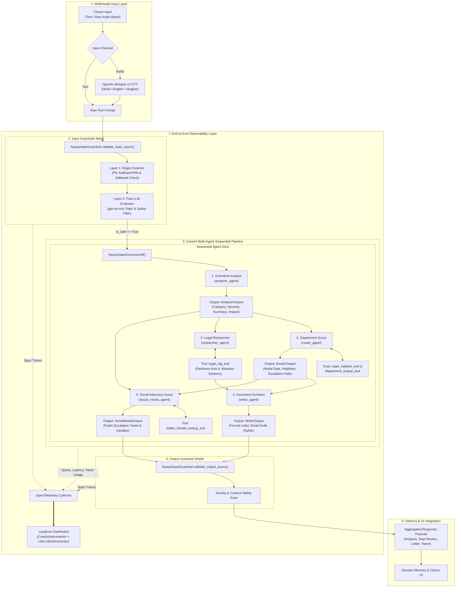
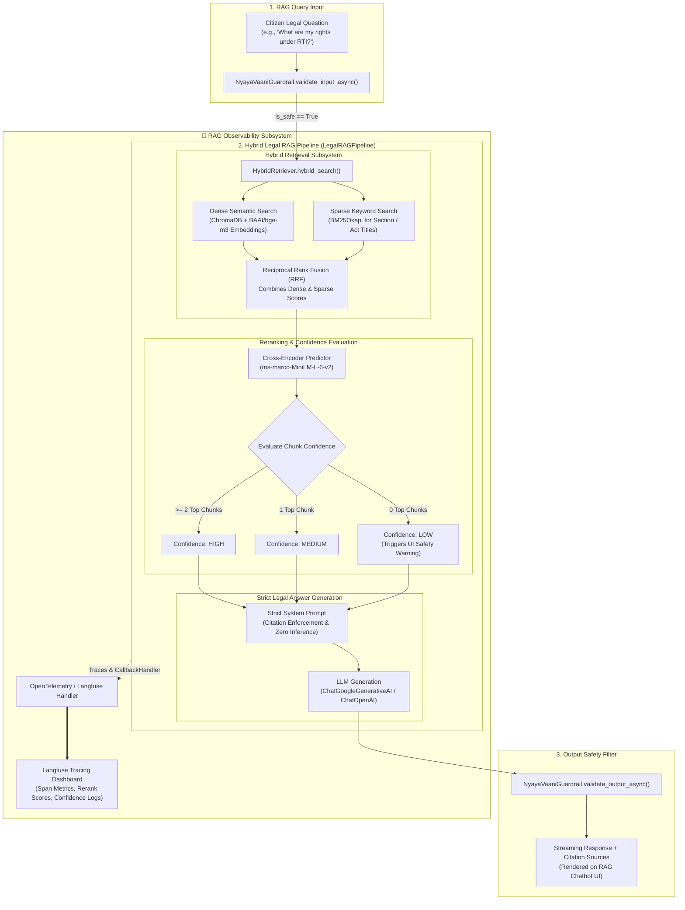

<div align="center">


# ⚖️ NyayaVaani: Agentic AI Civic Assistant

[](https://www.python.org/)
[](https://fastapi.tiangolo.com/)
[](https://deepmind.google/technologies/gemini/)
[](https://openai.com/research/whisper)
[](https://opensource.org/licenses/MIT)

**NyayaVaani** (Voice of Justice) is an advanced multimodal AI platform designed to bridge the gap between Indian citizens and the government by automating civic grievance redressal and legal awareness through **Agentic AI** and **Hybrid Legal RAG**.

[Explore Demo](#-installation--setup) • [Features](#-key-features) • [Architecture](#-system-architecture) • [Roadmap](#-future-roadmap)

</div>

---

## 📖 Table of Contents
- [Project Overview](#-project-overview)
- [Key Features](#-key-features)
- [System Architecture](#-system-architecture)
- [Tech Stack](#-tech-stack)
- [Installation & Setup](#-installation--setup)
- [Screenshots](#-screenshots)
- [Future Roadmap](#-future-roadmap)
- [Author](#-author)

---

## 🌟 Project Overview

Filing a civic grievance in India is often a complex and intimidating process. **NyayaVaani** simplifies this by allowing users to speak or type their problems in natural language. The system's "AI Agents" then work collaboratively to identify the correct legal department, calculate severity, and draft perfectly formatted formal documents.

---

## 🚀 Key Features

### 🤖 Multi-Agent Agentic Pipeline
Unlike traditional chatbots, NyayaVaani uses a **collaborative agentic workflow** (via CrewAI):
- **Grievance Analyst**: Breaks down the user's issue and identifies legal violations.
- **Department Scout**: Performs real-time research to find Central/State authorities and active helplines.
- **Document Architect**: Drafts legally-grounded Letters, Emails, and SMS alerts.

### 📚 Hybrid Legal RAG
A high-accuracy legal knowledge base that prevents hallucinations:
- **Hybrid Search**: Semantic similarity (Dense) combined with keyword matching (BM25 Sparse).
- **Cross-Encoder Reranking**: Every retrieved chunk is reranked and graded for relevance before being used.
- **Strict Grounding**: Citations from Indian Statutes are provided for every legal answer.

### 🎙️ Multimodal Accessibility
- **Voice-to-Action**: Integrated with **OpenAI Whisper** for high-accuracy voice transcription.
- **Vernacular Support**: Designed to handle mixed language (Hinglish) inputs common in India.

### 🎨 Premium UI/UX
- **Clean Aesthetic**: A modern White and Orange theme designed for professional civic engagement.
- **Compact Ratio**: Optimized layout for 80% screen ratio, ensuring a focused user experience.

---

## 🏗️ System Architecture

### 🤖 1. CrewAI Multi-Agent Execution Architecture
The multi-agent workflow handles civic complaint breakdown, authority lookup, statutory legal research, formal complaint drafting, and social media escalation in a strict sequential pipeline, wrapped under end-to-end security guardrails and OpenTelemetry observability:



---

### 📚 2. Hybrid Legal RAG Pipeline Architecture
The RAG pipeline provides statutory answers to citizen legal questions using hybrid dense-sparse retrieval, cross-encoder reranking, confidence scoring, and strict citation enforcement:



---

## 🛠️ Tech Stack

| Category | Technology |
| :--- | :--- |
| **Backend** | Python, FastAPI, Uvicorn |
| **LLM Orchestration** | CrewAI, LangChain |
| **Generative Models** | Google Gemini 2.5 Flash Lite |
| **Speech-to-Text** | OpenAI Whisper (v3) |
| **Vector DB** | ChromaDB |
| **Embeddings** | HuggingFace BGE-M3 |
| **Frontend** | HTML5, CSS3 (Vanilla), JavaScript (ES6) |

---

## 📦 Installation & Setup

1. **Clone the repository**
   ```bash
   git clone https://github.com/amitkarmakar07/NyayaVaani.git
   cd NyayaVaani
   ```

2. **Configure Environment**
   Create a `.env` file in the root:
   ```env
   GOOGLE_API_KEY=your_gemini_key
   OPENAI_API_KEY=your_whisper_key
   ```

3. **Install Dependencies**
   ```bash
   pip install -r requirements.txt
   ```

4. **Launch Application**
   ```bash
   python -m backend.api
   ```
   *Open `http://localhost:8000/frontend/index.html` in your browser.*
---

## ⚖️ License
Distributed under the MIT License. See `LICENSE` for more information.

---

## 👨‍💻 Author
**Amit Karmakar**  
*Data Science & AI Developer*

[LinkedIn](https://www.linkedin.com/in/amit-karmakar-355817258/)
